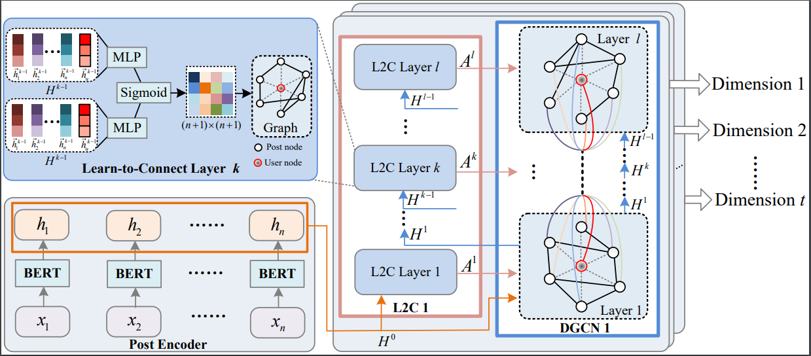

# Introduction

The source code of AAAI2023 paper "**Orders Are Unwanted: Dynamic Deep Graph Convolutional Network for Personality Detection**". The document describes how to reproduce the experiment result. We also provide a [Chinese version document](Readme_zh.md).

# Requirements

* [PyTorch](http://pytorch.org/) version >= 1.7
* [transformers](https://huggingface.co/docs/transformers/) version >= 2.9.0

Datasets and post-trained BERT are available in [Google Drive](https://drive.google.com/file/d/1wMB7jNhve2KJaoaFuX2o0JtDjH8wZ0CM/view?usp=share_link) and
[Baidu Netdisk](https://pan.baidu.com/s/1jURrE_XOWDOcoET7gN96Aw) (verification code: 96ap).
* [Pandora MBTI datasets](https://psy.takelab.fer.hr/datasets/all/pandora/) are not public datasets, please contact the author on the offical website for permission.

# Main Results

There are **2** datasets, [Kaggle](https://www.kaggle.com/datasnaek/mbti-type) and [Pandora MBTI datasets](https://psy.takelab.fer.hr/datasets/all/pandora/) for our evaluations.

Example cmd for running experiments on *Kaggle*

```shell
python main.py \
    --all_gpu_train_batch_size 8 \
    --all_gpu_eval_batch_size 32 \
    --num_train_epochs 25.0 \
    --task kaggle \
    --l0
```

apply *--l0* to enable L0 constraint on L2C, corresponding to **Eq(15)** in the paper, otherwise the training objective function is cross-entroty loss.

*all_gpu_train_batch_size* is set to 8 for *Kaggle*, and 4 for *Pandora*.

Best checkpoint is available in [Google Drive](https://drive.google.com/file/d/1EtkuvwLVGrnAusInltFKQoMvgC_9Wjxf/view?usp=share_link).

# Ablation Experiments

Reproduing some ablation experiments need to modify source code, we will improve it in the future work.

* single-hop: apply *--single_hop* in cmd
* remove special nodes(-u): *--no_special_node* in cmd
* undirected graph: change *False* to *True* for **line 35** in **graphmask.py**
* switch to GCN/GAT: change *self.dgcnx* to *Dynamic_GCN/Dynamic_GAT* for *Multi_DGCN* in **model_utils.py**
* no DART: apply *--no_dart* in cmd
