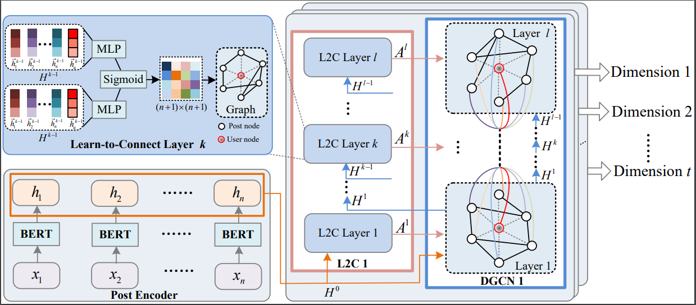

# Introduction

本文档介绍我们的论文《Orders Are Unwanted: Dynamic Deep Graph Convolutional Network for Personality Detection》（已被AAAI2023接收），以及其中的方法D-DGCN的源代码。 文档将介绍如何复现论文实验结果。



# Requirements

* [PyTorch](http://pytorch.org/) version >= 1.7
* [transformers](https://huggingface.co/docs/transformers/) version >= 2.9.0

数据集和后训练好的BERT模型在[谷歌云盘](https://drive.google.com/file/d/1wMB7jNhve2KJaoaFuX2o0JtDjH8wZ0CM/view?usp=share_link)和[百度网盘](https://pan.baidu.com/s/1jURrE_XOWDOcoET7gN96Aw)(验证码: 96ap)下载。
* [Pandora MBTI datasets](https://psy.takelab.fer.hr/datasets/all/pandora/)不是公开数据集, 请在官网联系作者获得许可.

# Main Results

我们总共使用了 **2** 个数据集进行测试：[Kaggle](https://www.kaggle.com/datasnaek/mbti-type)和[Pandora MBTI datasets](https://psy.takelab.fer.hr/datasets/all/)。

在*Kaggle*数据集上运行的命令示范

```shell
python main.py \
    --all_gpu_train_batch_size 8 \
    --all_gpu_eval_batch_size 32 \
    --num_train_epochs 25.0 \
    --task kaggle \
    --l0
```

使用*--l0*以启动L2C模块的L0约束, 即论文中的**Eq(15)**，否则训练目标函数只有交叉熵损失。

*all_gpu_train_batch_size*在*Kaggle*上设置为8, 在*Pandora*上设置为4.

# Ablation Experiments

部分消融实验的复现需要修改源代码，我们以后会对其进行优化。

* single-hop: 在cmd中输入*--single_hop*
* remove special nodes(-u): 在cmd中输入*--no_special_node*
* undirected graph: 将**graphmask.py**的**第35行**从*False*改为*True*
* switch to GCN/GAT: 在**model_utils.py**的*Multi_DGCN*里，将*self.dgcnx*改为*Dynamic_GCN/Dynamic_GAT*
* no DART: 在cmd中输入*--no_dart*
